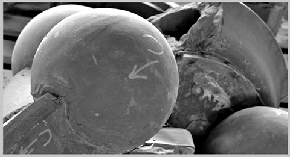
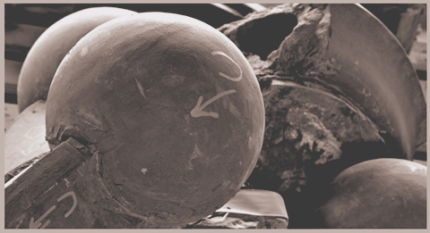
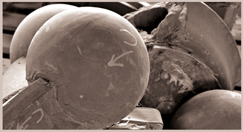

# ABWProfileMaker

## What problem does it solve:
Normally, black and white printing, when done with profiles, for instance using Quad Tone RIP, will
at best, not show in Photoshop the tint or deviation from neutral of the actual print.
This is problematic because prints are not perfectly neutral even when no tint is selected.
Additionally, subtle tints can provide an artistic touch to black and white prints.
Tools for making ICC profiles, such as those from X-Rite and the open source Argyll require
data sets that contain a range of RGB values and corresponding Lab (more formally L\*a\*b\*) values
result from measuring the printed colors.

ABWProfileMaker provides a process for creating ICC compliant profiles for use in Photoshop and other programs
that use ICC profiles to accurately display (aka softproof) and print black and white images using
black and white printing modes.

Black and White (and gray) modes are available on most printers designed to reproduce high
quality prints. Examples are Epson's "Advanced Black and White" mode and
Canon's Black and White Photo Print modes which are selectable in the driver.

For example, this image from a B&W crop from one of Keith Copper's (North Light Images).

When printed on Matte paper on an Epson 9800 using ABW mode with a maximum orange tint prints like
this using Relative Colorimetric Intent without using BPC (Black Point Compression):

Using BPC lightens the overall image to bring out features in darker areas that are otherwise
not printable.

## Overview

The ABWProfileMaker program accomplishes this in conjunction with regular tools for making
ICC profiles by taking B&W patch measurements, including any tints, and making two
sets of RGB, Lab values in CGATs (an industry interchange format).
Profiles are made from each of these. The second profile
has the a\* and b\* values cleared. Both CGATs files contain additional, synthesized, non-neutral
RGB and Lab values. The synthesized colors are needed so that the profile software works correctly
since it expects a color gamut, not black and white data.

As a result, one profile contains correct lookup tables for printing (B2A tables) while the
other contains correct values for converting the RGB values the printer sees (A2B tables)
to the colors actually printed. Both must be correct to get good prints and to see what
will be printed in Photoshop's View Soft Proof dialog.

## ABWProfileMaker use:

There are three uses of the program.
*    First one runs the program `ABWProfileMaker [S|L] [n]`  
This creates sets of CGATs neutral RGB patches with
spacings of 5 (RGB (0,0,0; 5,5,5; ... 255,255,255) for the `S` option or spacing of 1 for
the `L` option which will generate all 256 RGB sets. Additionally, the set can be
duplicated multiple times and scrambled to minimize any process variation such as measurement
noise. The file will be labeled: Neutrals_52.txt or Neutrals_256.txt. `S` along with an `n`
of 3 or more is recommended.
If a repeat count `n` is used the file will be Repeat_n_Neutrals_52.txt
or Repeat_n_Neutrals_256.txt. With `n` set at 2 or more you will also get statistics showing the
average standard deviation of L*, a*, and b* between patches of the same RGB values.
This can then be loaded (dragged and dropped into the patches icon) into XRite's
I1Profiler to create charts to print. Save the printer's B&W settings as it's important
to use these same settings when printing future B&W images using this generated profile.
and measure with one of XRite'sspectrophotometers. The measurement file must be saved as CGATs file.

* Then run the program:  
    `ABWProfileMaker measurementfile.txt [profilename.txt]`  
This will create `profilename.txt` and `profilename_adj.txt`. with additional synthesized
colors. Now create the two profiles keeping the same names. `profilename.txt` is optional. If left out
the program will only print statistics for the measurement file and not generate CGATs files to create
profiles. You can use I1Profiler if licensed to make profiles or Argyll's
programs which are free. I recommend high quality settings but the defaults are fine.
Just use the same settings for both.

* With both icm profiles in the same directory. Run:  
    `ABWProfileMaker profilename.icm`  
This copies the A2B1 table from `profilename_adj.icm` into `profilename.icm`'s A2B1 table
making a profile that correctly both prints and soft proofs black and white images. This works
because the A2B1 table is used only for soft proofing and has no affect on what is printed.

## Installation
The provided C++17 code is portable and requires no libraries. Just load the
`.h` and `.cpp` files in the same directory, compile the source files,
and link into an executable. A Windows (7 or later) executable is provided.

A simple batch file is provided that executes the commands for those that wish
to use Argyll's profiling tools.

### notes:
The second step in making the synthesized patch sets has an additional feature. It prints out
a distribution that shows how much dE20000 variation occurs between steps of 5 and 15.
This provides information on how smooth the neutral tone transitions are.  Additionally,
if duplicates were selected when creating the patch set, it prints out the statistical
distribution of L*, a* and b* between the same patches. This is useful for checking the
consistency the printer.

One easy way to see how much better ABW mode over just using standard color printing to
print black and white images is to compare ABW against printing the neutral patches using
standard color settings. I see over a 2 to 1 reduction in errors using ABW.

Here is a comparison of the statistics for Glossy (PK Ink) on the Epson 9800 using
ABW and using the same, device neutral patch set with full color selected.

These are the statistics in color mode. This shows that adding CYM inks, even with
device neutral patches (R=G=B), which is required for color printing,
produces much higher measurement variations.

    -----ABWProfilePatches V1.2-----

    Statistics for: 9800Neutrals52x5_dev_M2.txt

    White Point L*a*b*: 94.89 -1.54 -2.00
    Black Point L*a*b*:  3.59 -0.29 -0.91
    At RGB130   L*a*b*: 32.14 -1.07  0.55

          ---Patch deltaE2000 variations---
    These are deltaE2000 variations from the averages of RGB patches
    comparing patch values with those of adjacent patches either
    5 RGB steps or 15 RGB steps away.  Also shown are the deltaE200
    variations but with a* and b* ignored.  This is useful to evaluate
    Luminance without color shifts from neutral. These variations are much
    smaller since a* and b* contribute heavily to deltaE2000 calculations.
    Note: L* a* and b* are standard deviations of individual patches, not
    dE2000, and are only printed when the charts have duplicated RGB patches

    Steps (with ab zeroed)       5    15      5z   15z       L*    a*    b*
     50 Percent of dE00s <=   0.11  0.67    0.03  0.31     0.13  0.08  0.10
     75 Percent of dE00s <=   0.18  0.82    0.08  0.38     0.18  0.12  0.12
     90 Percent of dE00s <=   0.23  0.96    0.11  0.54     0.24  0.16  0.14
     95 Percent of dE00s <=   0.33  1.22    0.14  0.72     0.25  0.21  0.15
     98 Percent of dE00s <=   0.38  1.65    0.17  0.80     0.34  0.25  0.18
    100 Percent of dE00s <=   0.52  2.12    0.19  0.96     0.37  0.27  0.26

And these are the statistics with ABW

    -----ABWProfilePatches V1.2-----

    Statistics for: 9800Neutrals52x5_ABWy_M2.txt

    White Point L*a*b*: 94.89 -1.53 -2.10
    Black Point L*a*b*:  2.87  0.27 -0.26
    At RGB130   L*a*b*: 54.54  6.06 11.52

          ---Patch deltaE2000 variations---
    These are deltaE2000 variations from the averages of RGB patches
    comparing patch values with those of adjacent patches either
    5 RGB steps or 15 RGB steps away.  Also shown are the deltaE200
    variations but with a* and b* ignored.  This is useful to evaluate
    Luminance without color shifts from neutral. These variations are much
    smaller since a* and b* contribute heavily to deltaE2000 calculations.
    Note: L* a* and b* are standard deviations of individual patches, not
    dE2000, and are only printed when the charts have duplicated RGB patches

    Steps (with ab zeroed)       5    15      5z   15z       L*    a*    b*
     50 Percent of dE00s <=   0.04  0.26    0.02  0.11     0.10  0.05  0.08
     75 Percent of dE00s <=   0.05  0.32    0.03  0.20     0.13  0.07  0.10
     90 Percent of dE00s <=   0.08  0.43    0.05  0.24     0.15  0.08  0.13
     95 Percent of dE00s <=   0.23  0.81    0.11  0.27     0.16  0.08  0.14
     98 Percent of dE00s <=   0.30  0.94    0.11  0.30     0.20  0.10  0.16
    100 Percent of dE00s <=   0.30  1.12    0.15  0.64     0.20  0.11  0.17

For Keith's example images, Matte paper was used with PK ink on the Epson 9800.
PK ink has quite a high L* minimum (darkest black) but more effectively shows the value of
soft proofing. Here's the statistics on the Matte ABW mode which shows even lower variation than
the ABW on glossy above.

    -----ABWProfilePatches V1.2-----
    Statistics for: 9800ABWyMatte.txt
    Statistics for: Neutrals52x5.txt 6x6 cnt261 dpi600 09-26-19  9-18pm 9800abw_52x52_m2.txt

    White Point L*a*b*: 92.89  0.95 -0.88
    Black Point L*a*b*: 24.32  0.36 -0.02
    At RGB130   L*a*b*: 49.12  5.83  6.22

          ---Patch deltaE2000 variations---
    These are deltaE2000 variations from the averages of RGB patches
    comparing patch values with those of adjacent patches either
    5 RGB steps or 15 RGB steps away.  Also shown are the deltaE200
    variations but with a* and b* ignored.  This is useful to evaluate
    Luminance without color shifts from neutral. These variations are much
    smaller since a* and b* contribute heavily to deltaE2000 calculations.
    Note: L* a* and b* are standard deviations of individual patches, not
    dE2000, and are only printed when the charts have duplicated RGB patches

    Steps (with ab zeroed)       5    15      5z   15z       L*    a*    b*
     50 Percent of dE00s <=   0.03  0.20    0.02  0.10     0.10  0.03  0.07
     75 Percent of dE00s <=   0.04  0.25    0.03  0.20     0.12  0.04  0.08
     90 Percent of dE00s <=   0.06  0.32    0.04  0.24     0.14  0.05  0.10
     95 Percent of dE00s <=   0.07  0.45    0.04  0.25     0.15  0.06  0.10
     98 Percent of dE00s <=   0.07  0.52    0.05  0.29     0.16  0.07  0.11
    100 Percent of dE00s <=   0.08  0.55    0.05  0.30     0.17  0.08  0.15
