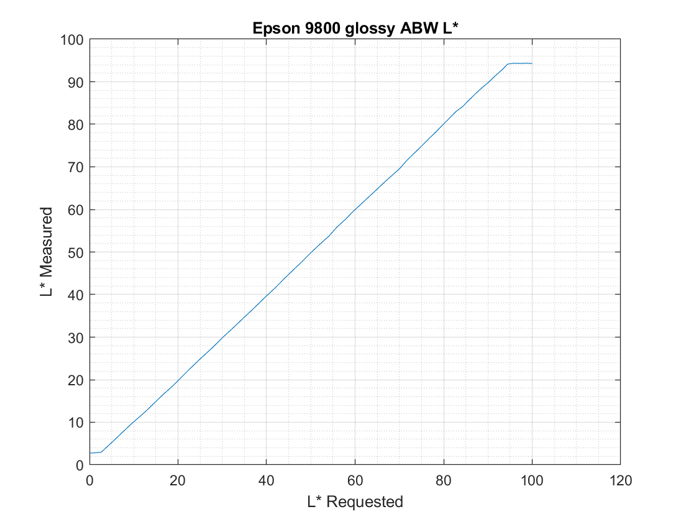

# ABWProfileMaker
<!-- Comment See [create an anchor](#Technical-Overview) -->

## Program to Create B&W ICC Profiles

**ABWProfileMaker** Is a Windows based tool used to create ICC Profiles that can be
used to accurately print black and white images using programs that impliment ICC color management
like Photoshop. It is unique in comparison to other tools in that it
creates a fully functional B&W profile for use in Black and White
workflows and is used in the same manner as regular color managed printing. For instance,
letting Photoshop manage "colors" and selecting Relative Intent with/without BPC.
It produces accurate soft proofs including things like the subtle tones when printing B&W sepia.

A big reason to use the printer's B&W mode is that prints are more stable and blacks are printed
more smoothly. The printer uses only small amounts of CYM inks in black and white mode. One can
see the measured difference as smaller variations in patch colors in the comparison
[here](#abw-v-printing-black-and-white-in-full-color-mode).

#### Workaround for Printers (Canon, etc) that don't show custom profiles printing B&W in Photoshop
Photoshop sometimes disables showing non OEM profiles when you select B&W in the printer's dialog.
This is a problem with Canon, among other, printers. Fortunately, there is a workaround that will
not only show the custom profiles, but put them in the top selection area. This is also handy
for putting regular, color, custom profiles that you have made at the top for rapid access.

Open Windows Color Management dialog. Then select use profile checkbox then push the ADD button.
This displays the installed profiles. Select your custom profile.
Now it will show up in Photoshop's print dialog and you can select it to both soft proof and
Photoshop's color managed printing.

#### Requirements
Windows x64, 7,8, or 10.
Spectrophotometer and software than can read printed patches and produce a CGATs file.
Software than creates ICC profiles from CGATs files. Tested with Argyll and I1Profiler.
Argyll is recommended but I1Profiler, which requires a license to make profiles, can be used.
However, I1Profiler requires an additional manual step since it doesn't have a command line
batch processing mode.

#### Overview of how it's done
The program reads a CGATs measurement file of black and white patches. It then creates two
new CGATs file with synthesized colors added. The first tosses out the color info (Lab's a* and b*)
and adds synthesized colors so that an accurate printing profile can be constructed. The
second CGATs file retains the (a* and b*) of the neutral patches and then adds synthesized
colors around them. The profile created from this file is not accurate for printing but
it is accurate for the reverse lookup that soft proofing uses. Then the program splices in the
soft proof lookup tables from the second profile into the first profile creating
a profile that can be used for both printing and soft proofing.

This is the tone curve (L*) from my Epson 9800 using Absolute Col. Intent. It's from
actual measurements of neutral patches from L*=0 to 100. It's correctly shows clipping
at the paper's darkest black and white of unprinted paper. Elsewhere, the match between requested L*
and actual printed L* is nearly perfect. If printed with Relative and BPC
the line goes straight from L=0 to 100 since the L* is expanded to 0 and 100.

To minimize configuration errors I highly recommend B&W images be in sRGB colorspace.
The sRGB tone curve, while suboptimal for color,
is actually better than other working spaces for black and white. This is because the deltaE
between RGB steps is almost always lower than that of other spaces like Adobe RGB or ProPhoto
RGB as a result of the lead in ramp sRGB has. sRGB more effectively spreads out the change in L*
over the full RGB range while its smaller overall color
gamut isn't relevant to black and white images.

Standard ICC profiles are those made from patches printed w/o "color" management.
They can be used for soft proofing and printing B&W using Relative or Absolute
colorimetric intents using the same process as color printing with "Photoshop Manages Colors."
Some printers (Epson with ABW) will show all installed profiles when the
driver is in B&W mode. Others won't automatically but are easily added using Microsoft's
"Color Management" Control panel. This is also convenient for regular color printing
since the profiles will show up at the top of the profile list in Photoshop. Open up
the Color Management Control Panel. Select the B&W printer,
and set the "use my settings for this device" then select your custom B&W profile from
the list of installed profiles. Now it will show up in Photoshop's print dialog.

#### Making a Photoshop Color Managed Profile for Black and White
This operates in Photoshop
just like regular printing letting Photoshop manage color printing - but with a B&W profile!
It does require that the image be in RGB but with no color.
Thus each value of R,G, and B are equal to each other.
And only the L* is controlled by the profile. a* and b* are determined entirely by the settings in
the printer driver's B&W mode such as setting the tone to "warm"
Printing should be normally be done with Relative Colorimetric Intent. BPC is optional. Precision grays
of known L* can be printed using Absolute Colorimetric.

To create a standard B&W profile print the chart in the *misc* directory
that matches your instrument (I1Pro, I1Pro2, or i1iSis). Here is an image of the i!Pro 2
260 patch chart included in the *misc* directory.

Make sure you save your
black and white printer settings in the printer driver so you can load the same settings
when you print in the future. It's a good idea to name the profile and saved settings the same.
Use Adobe ACPU or other program that bypasses color management. Alternately, you can use I1Profiler
to print the provided chart. Load the appropriate chart *.txf*, also in directory *misc*.
For instance: *Repeat_5x_Neutrals_52_I1Pro2.txf*. The charts provided
contain 260 patches which are the RGB sequence (0,0,0), (5,5,5), ... to (255,255,255)
repeated 5 times and scrambled. Scan the print with a spectrophotometer using I1Profiler
and save the measurement data as a CGATs text file by selecting "Save" then entering
a file name and selecting "i1Profiler CGATS CIELab (*.txt)".

#### Constructing the B&W Profile
Now just execute ABWProfilerMaker with the name of the measurement file and the desired
profile name. This will make the two special CGATs files as well as print metrics and statistical
information.

    ABWProfileMaker measurementfile.txt desiredprofilename

The last step is to execute the batch file that calls Argyll utilities to create the profile:

    make_argyll_abw_profile

That's it! You now have a B&W profile suitable for use in printing and soft proofing.
Be sure to install it or just copy it into *C:\Windows\System32\spool\drivers\color*

And here's what the print and image softproof looks like when printed letting the printer manage color.
The first was with the 9800 set for "darkest" tone and the second with "lighter."

## Description in Depth
Often, black and white printing, when done with profiles will,
at best, not show in Photoshop the tint or deviation from neutral of the actual print.
This is problematic because prints are not perfectly neutral even when no tint is selected.
Additionally, subtle tints can provide an artistic touch to black and white prints.
It's desirable for soft proofing to show this tint. For example
the Sepia or Cold settings in Epson ABW printers.

Tools for making ICC profiles, such as those from X-Rite and the open source Argyll
assume RGB color and require
data sets that contain a range of RGB values and corresponding Lab (more formally L\*a\*b\*) values
that result from measuring the printed colors.
ABWProfileMaker provides a process for creating ICC compliant profiles for use in
Photoshop and other programs that use ICC profiles to accurately display
(aka softproof) and print black and white images using black and white printing modes.

Black and White modes are available on most printers designed to reproduce high
quality prints. Examples are Epson's "Advanced Black and White" mode and
Canon's Black and White Photo Print modes which are selectable in the driver.

For example, this image from a B&W crop from one of Keith Copper's (North Light Images).

When printed on Matte paper on an Epson 9800 using ABW mode, PK ink, 
with a maximum yellow-orange tint prints like
this using Relative Colorimetric Intent without using BPC (Black Point Compression):

Using BPC lightens the overall image to bring out features in darker areas that are otherwise
not printable. This is especially noticeable on matte prints with low DMax (high black L*).

## Technical Overview

The ABWProfileMaker program accomplishes this in conjunction with regular tools for making
ICC profiles by taking B&W patch measurements, including any tints, and making two
sets of RGBLAB values in CGATs (an industry interchange format). The a* and b* values are
zeroed for the first created RGBLAB set while the second set uses measured a* and b*.
Profiles are made from each of these. The first set is zeroed because we want the profile to map
neutral RGB values to neutrals to send to the printer. This provides accurate L* for 
the B&W print. The second profile keeps the a* and b* values. This provides accurate
data for soft proofing. Since this data is in the AtoB profile tables, this table is
then copied into the first profile replacing its AtoB tables.
Both CGATs files contain additional, synthesized, non-neutral
RGB and Lab values. The synthesized colors are needed so that the profile software works correctly
since it expects a color gamut, not black and white data.

Note that the profile is for use only when printing B&W images using the printer's B&W mode.

### ABWProfileMaker Detailed use:

Several steps are required to create a Black and White profile. First a set of neutral steps is generated and printed.
Second, the printed chart is scanned with a spectrophotometer like an XRite I1 Pro 2 or i1iSis and
the CGATs measurements including RGB and L*a*b* values are saved. Third, the measurement file
is read by ABWProfileMaker which creates 2 CGATs files as well as a batch file which uses Argyll to
create 2 profiles and ABWProfileMaker then splices the AtoB tables of the second profile into the first.

Target charts for printing and/or loading into I1Profiler are provided in the misc directory
for the supported spectrophotometers.
These were made from the command: **ABWProfileMaker -S 5**, which creates a 260 CGATs patch set.
Also provided are measurement files and the created profiles
in neutral, cool, and sepia ABW settings for the Epson 9800 using glossy paper. You can use the
measurement files to test out your Argyll installation.

Here is how ABWProfileMaker was used to create the profile used for the images above printed on an
Epson 9800 with ABW. 

Spectro measured CGATs files are provided in the "misc" directory. These files
are from a set of 260 patches which are (0,0,0), (5,5,5), ...(255,255,255) repeated 5 times
then scrambled to minimize spectro reading errors when creating the profile. The following command
reads in the black and white CGATs file and creates 2 synthetic CGATs files containing RGB and Lab
info. Synthetic colors are added where RGB are non neutral so that profiling software can
create profiles but accurate info for the RGB/Lab neutrals are retained. Part of the process
prints out statistical information,
including paper white and black ink L*, that is useful for looking at the "lumpiness" and random
variation of the measured patches. See
[B&W statistics](#these-are-the-statistics-printing-black-and-white-images-using-abw)

    ABWProfileMaker 9800_Y_ABW52x5Matte_M2.txt 9800_ABW_Y_Matte

Then you run the newly created batch file. It generates 2 profiles using Argyll profiling
tools then splices the AtoB table from the second profile into the first to enable soft proofing.
Temporary files are removed. This executes the batch file and creates the profile:
"9800_ABW_Y_Matte.icm".

    make_argyll_abw_profile

Alternately, if you have a licensed I1Profiler you don't need Argyll tools and can make profiles manually
from the two created CGATs files then execute ABWProfileMaker with the profile name in the same
order as the batch command file does it. Results are effectively identical. I prefer Argyll since
I1Profiler doesn't offer batch processing.

Install the profile or copy to your computer's profile directory:
"C:\Windows\System32\spool\drivers\color"

### ABWProfileMaker command line options
You can also run the program in steps that create the patch set, process spectro measurements,
and splice reverse lookup color into the printing profile.
Here's the instructions you get just running the program with no arguments:

    -----ABWProfileMaker V2.1-----
         ---------- Step 1 -----------
    ABWProfilePatches S|L [n]
      Creates RGB CGATS file Where S generates 52 RGB patches 0:5:255,
      L generates 256 RGB patches 0:1:255 and the optional [n] is number
      of pattern repeats

         ---------- Step 2 -----------
    ABWProfilePatches MeasurementFilename.txt ProfileName
      If only MeasurementFilename is given, just display statistics,
      and extended tracking accuracy, otherwise
      Reads a ABW CGATS measurement file of neutral patches and creates
      synthetic RGBLAB CGATs files named "ProfileName.txt" and "ProfileName_adj.txt"
      from which one creates ICC profiles. Then make profiles from these two files
      using an automatically created batch file "make_argyll_abw_profile.bat"
      if you have Argyll's software installed or manually with a program like I1Profiler

         ---------- Step 3 -----------
    ABWProfilePatches Profile
      Where profile is the name of base profile with a suffix of ".icm"
      There must be two profiles from the previous step. The second profile has the
      same name with "_adj" added. The A2B1 tables inside the Profile_adj.icm
      will replace the A2B1 table inside Profile.icm. Discard the "_adj" profile.
      and install the first.

## Installation
A Windows x64 (64 bit) executable is provided. For those that wish to use Linux or
iOS, there is standard source code.
The provided C++17 code is portable and requires no libraries.
A Visual Studio 2019 project is provided but one can also just load the
`.h` and `.cpp` files in the same directory, compile the source files,
and link into an executable.

### Comparing Printing Black and White in Full Color Mode
The second step in making the synthesized patch sets has an additional feature. It prints out
a distribution that shows how much dE20000 variation occurs between steps of 5 and 15.
This provides information on how smooth the neutral tone transitions are.  Additionally,
if duplicates were selected when creating the patch set, it prints out the statistical
distribution of L*, a* and b* between the same patches. This is useful for checking the
consistency the printer.

One easy way to see how much better Black and White mode over just using standard color printing to
print black and white images is to compare Black and White against printing the neutral patches using
standard color settings. I see over a 2 to 1 reduction in errors using Black and White.

Here is a comparison of the statistics for Glossy (PK Ink) on the Epson 9800 using
ABW and using the same, device neutral patch set with full color selected.

These are the statistics in color mode. This shows that adding CYM inks, even with
device neutral patches (R=G=B), which is required for color printing,
produces much higher measurement variations.

##### These are the statistics printing black and white images using full color mode

    -----ABWProfilePatches V2.0 in color printing mode-----

    Statistics for: 9800Neutrals52x5_dev_M2.txt

    White Point L*a*b*: 94.89 -1.54 -2.00
    Black Point L*a*b*:  3.59 -0.29 -0.91
    At RGB130   L*a*b*: 32.14 -1.07  0.55

    ---Patch deltaE2000 variations B&W printed using full color mode---
    These are deltaE2000 variations from the averages of RGB patches
    comparing patch values with those of adjacent patches either 5 RGB
    steps or 15 RGB steps away.  Also shown are the deltaE200 variations
    but with a* and b* ignored (eg, 5z, 15z).  This is useful to evaluate
    Luminance without color shifts from neutral. These variations are much
    smaller since a* and b* contribute heavily to deltaE2000 calculations.
    Note: L* a* and b* are standard deviations of individual patches, not
    dE2000, and are only printed when the charts have duplicated RGB patches

    Steps (with ab zeroed)       5    15      5z   15z       L*    a*    b*
     50 Percent of dE00s <=   0.11  0.67    0.03  0.31     0.13  0.08  0.10
     75 Percent of dE00s <=   0.18  0.82    0.08  0.38     0.18  0.12  0.12
     90 Percent of dE00s <=   0.23  0.96    0.11  0.54     0.24  0.16  0.14
     95 Percent of dE00s <=   0.33  1.22    0.14  0.72     0.25  0.21  0.15
     98 Percent of dE00s <=   0.38  1.65    0.17  0.80     0.34  0.25  0.18
    100 Percent of dE00s <=   0.52  2.12    0.19  0.96     0.37  0.27  0.26

##### These are the statistics printing black and white images using ABW

    -----ABWProfilePatches V2.0 in ABW mode -----

    Statistics for: 9800Neutrals52x5_ABWy_M2.txt

    White Point L*a*b*: 94.89 -1.53 -2.10
    Black Point L*a*b*:  2.87  0.27 -0.26
    At RGB130   L*a*b*: 54.54  6.06 11.52

    ---Patch deltaE2000 variations B&W printed using ABW---
    Steps (with ab zeroed)       5    15      5z   15z       L*    a*    b*
     50 Percent of dE00s <=   0.04  0.26    0.02  0.11     0.10  0.05  0.08
     75 Percent of dE00s <=   0.05  0.32    0.03  0.20     0.13  0.07  0.10
     90 Percent of dE00s <=   0.08  0.43    0.05  0.24     0.15  0.08  0.13
     95 Percent of dE00s <=   0.23  0.81    0.11  0.27     0.16  0.08  0.14
     98 Percent of dE00s <=   0.30  0.94    0.11  0.30     0.20  0.10  0.16
    100 Percent of dE00s <=   0.30  1.12    0.15  0.64     0.20  0.11  0.17

### Example: Making ABW Profile for Epson 9800
Example of Epson 9800 on Matte using PK inks (high black point L*). Files are in the
*misc* directory. PK ink has quite a high L* minimum (darkest black) but better shows
soft proofing. Here's the statistics.

##### Create Synthetic CGATs Files from B&W Patch File
    G:\test>ABWProfileMaker 9800_Y_ABW52x5Matte_M2.txt 9800_ABW_Y_Matte

    -----ABWProfileMaker V2.0-----
    Creating synthetic patch sets
      From: 9800_Y_ABW52x5Matte_M2.txt
      To:   9800_ABW_Y_Matte.txt
      And:  9800_ABW_Y_Matte_adj.txt
    And a batch file to make Argyll profiles: make_argyll_abw_profile.bat

    White Point L*a*b*: 92.89  0.95 -0.90
    Black Point L*a*b*: 24.32  0.36 -0.02

          ---Patch deltaE2000 variations---
    These are deltaE2000 variations from the averages of RGB patches
    comparing patch values with those of adjacent patches either
    5 RGB steps or 15 RGB steps away.  Also shown are the deltaE200
    variations but with a* and b* ignored.  This is useful to evaluate
    Luminance without color shifts from neutral. These variations are much
    smaller since a* and b* contribute heavily to deltaE2000 calculations.
    Note: L* a* and b* are standard deviations of individual patches, not
    dE2000, and are only printed when the charts have duplicated RGB patches

    Steps (with ab zeroed)       5    15      5z   15z       L*    a*    b*
     50 Percent of dE00s <=   0.03  0.20    0.02  0.10     0.10  0.03  0.07
     75 Percent of dE00s <=   0.04  0.25    0.03  0.20     0.12  0.04  0.08
     90 Percent of dE00s <=   0.06  0.33    0.04  0.24     0.14  0.05  0.10
     95 Percent of dE00s <=   0.07  0.45    0.04  0.25     0.15  0.06  0.10
     98 Percent of dE00s <=   0.07  0.52    0.05  0.29     0.16  0.07  0.11
    100 Percent of dE00s <=   0.08  0.55    0.05  0.30     0.17  0.08  0.15

##### Execute the Created Command File: *make_argyll_abw_profile*
    G:\test>make_argyll_abw_profile

    G:\test>set ARGYLL_CREATE_WRONG_VON_KRIES_OUTPUT_CLASS_REL_WP=1
    G:\test>txt2ti3 9800_ABW_Y_Matte.txt 9800_ABW_Y_Matte
    G:\test>colprof -r .1 -qh -D 9800_ABW_Y_Matte.icm -O 9800_ABW_Y_Matte.icm 9800_ABW_Y_Matte
    G:\test>txt2ti3 9800_ABW_Y_Matte_adj.txt 9800_ABW_Y_Matte_adj
    G:\test>colprof -r .1 -qh -D 9800_ABW_Y_Matte_adj.icm -O 9800_ABW_Y_Matte_adj.icm 9800_ABW_Y_Matte_adj
    G:\test>erase 9800_ABW_Y_Matte.ti3
    G:\test>erase 9800_ABW_Y_Matte_adj.ti3
    G:\test>erase 9800_ABW_Y_Matte.txt
    G:\test>erase 9800_ABW_Y_Matte_adj.txt

    G:\test>ABWProfileMaker 9800_ABW_Y_Matte.icm
    -----ABWProfileMaker V2.0-----
    Replaced A2B1 table in 9800_ABW_Y_Matte.icm with 9800_ABW_Y_Matte_adj.icm
    9800_ABW_Y_Matte.icm may now be used to print and softproof ABW.

    G:\test>erase 9800_ABW_Y_Matte_adj.icm
    G:\test>rem Install 9800_ABW_Y_Matte.icm in "C:\Windows\System32\spool\drivers\color"
    G:\test>

### Evaluating Profile Accuracy

ABWProfileMaker can also evaluate the accuracy of a B&W profile or color profile when printing black and white.
This is done by printing a chart that
is assigned to sRGB in one of three modes: Relative Colorimetric with BPC, Relative Colorimetric without BPC,
or Absolute Colorimetric. All three modes are deterministic. The printed patch, Lab values are colorimetric.
Absolute mode should track the chart's sRGB for measurements that are in gamut. That is, when the printed patches
are above the paper's black ink and below the paper's unprinted (white). Relative Colorimetric mode expands
the upper range such that sRGB's white corresponds the measured paper white. In addition, the XYZ values are
shifted so that paper white corresponds to Lab=(100,0,0).  Relative Colorimetric mode with BPC is further altered
by shifting the paper's black point to Lab=(0,0,0). So while the paper's blackest black might be L*=4 and the
whitest white is L*=94. the image Lab values are smoothly mapped all the way from L*=0 to L*=100. This prevents
blocking of light and dark areas that exceed the paper's capability.

When ABWProfileMaker is executed with only one argument and that argument is a text file (ends with ".txt"),
the measurement file will be evaluated as if the chart image was in sRGB. The print mode,
be it Abs., Rel. or Rel. with BPC is detected automatically. The sRGB, sRGB L\*, Projected L\* values,
measured Lab values and differences with the projected sRGB L\* printed.

[Here's the result when the chart](#chart-printed-with-BPC-on-glossy-with-my-9800)
is printed with BPC on glossy with my 9800. The first few lines show RGB values of 0,0,0 and 5,5,5 with an
L\* of 0.0 and 1.4. The projected L\* values, (2.8 and 4.0), are the ideal, calculated values. The measured
L\*a\*b\* values are next. The last column is the difference between the projected (ideal) L\* and the
measured L\*. The set can be considered deltaE's showing the quality of the profile at each point.
Black and white profiles have no control over a\* and b\*.

The measured Lab, scaled for white and black point is (0,0,0) and (1.1, .1, .1)
and the "Diff" column shows that the printed L* is .3 less than the ideal, scaled value.

    Continuous slope, may be Relative Colorimetric with BPC
    RGB  L*(sRGB)  L*(proj)  L*a*b* (Measured)   Diff
      0    0.0       2.8       2.8 -0.2 -0.6      0.0
      5    1.4       4.0       3.7 -0.2 -0.5     -0.3

Here's a chart showing the measured, scaled Lab values comparing Black and White (default neutral) and standard, full color mode.
Black and White printing provides smoother transitions over the RGB steps as much less CYM ink is used and
the 9800 has 3 gray/black inks. Full color printing, even of pure neutrals, uses a lot of CMY inks to facilitate
smooth transitions to color. These introduce more low level variation in the printed measurements. Another
point is that Black and White printing can not adjust a* or b*. What you see is what you get. It can only be changed
by altering the driver settings. For instance selecting Sepia or Cold for a B&W print.

##### chart printed with BPC on glossy with my 9800

This shows the 52 chart steps when assigned sRGB and printed using Photoshop
Manages Color and selecting the custom B&W profile. Options were Rel. Col. with BPC.
This has the effect of scaling the Lab values from the sRGB patches between the
paper's black and white points. Executing the program with one argument that
is the text file of spectrophotometer measurements produces two groups of data.
The first group shows various stats that are useful for detecting abrupt changes
as well as variations between patches that have the same RGB values.

Command: *ABWProfileMaker Repeat_5x_Neutrals_52_9800_Costco_Def_sRGB_M2.txt*

    -----ABWProfileMaker V2.1-----
    Statistics for: Repeat_5x_Neutrals_52_9800_Costco_Def_sRGB_M2.txt

    White Point L*a*b*: 94.81 -1.52 -1.82
    Black Point L*a*b*:  2.80 -0.18 -0.55

          ---Patch deltaE2000 variations---
    These are deltaE2000 variations from the averages of RGB patches
    comparing patch values with those of adjacent patches either
    5 RGB steps or 15 RGB steps away.  Also shown are the deltaE200
    variations but with a* and b* ignored.  This is useful to evaluate
    Luminance without color shifts from neutral. These variations are much
    smaller since a* and b* contribute heavily to deltaE2000 calculations.
    Note: L* a* and b* are standard deviations of individual patches, not
    dE2000, and are only printed when the charts have duplicated RGB patches

    Steps (with ab zeroed)       5    15      5z   15z       L*    a*    b*
     50 Percent of dE00s <=   0.03  0.14    0.02  0.06     0.09  0.04  0.06
     75 Percent of dE00s <=   0.05  0.19    0.02  0.10     0.13  0.05  0.08
     90 Percent of dE00s <=   0.05  0.23    0.04  0.13     0.16  0.06  0.10
     95 Percent of dE00s <=   0.06  0.27    0.05  0.23     0.18  0.07  0.11
     98 Percent of dE00s <=   0.10  0.39    0.09  0.38     0.20  0.08  0.11
    100 Percent of dE00s <=   0.10  0.55    0.10  0.55     0.22  0.10  0.13

The second part shows the accuracy of the profile. L\*(sRGB) is the luminance of
the sRGB values and goes from 0 to 100.  L\*(proj) is the scaled sRGB luminance
and is calculated based on the intent of the printed image.

    Continuous slope, may be Relative Colorimetric with BPC
    RGB  L*(sRGB)  L*(proj)  L*a*b* (Measured)   Diff
      0    0.0       2.8       2.8 -0.2 -0.6      0.0
      5    1.4       4.0       3.7 -0.2 -0.5     -0.3
     10    2.7       5.2       5.0 -0.2 -0.5     -0.2
     15    4.3       6.6       6.6 -0.1 -0.6      0.0
     20    6.3       8.3       8.3 -0.2 -0.7      0.0
     25    8.8      10.2      10.2 -0.2 -0.7     -0.1
     30   11.3      12.2      12.1 -0.1 -0.8     -0.1
     35   13.7      14.2      14.1 -0.1 -0.9     -0.1
     40   16.1      16.3      16.0 -0.1 -1.1     -0.2
     45   18.5      18.3      18.1  0.0 -1.2     -0.2
     50   20.8      20.4      20.3  0.1 -1.3     -0.1
     55   23.1      22.4      22.4  0.1 -1.3      0.0
     60   25.3      24.4      24.5  0.1 -1.3      0.1
     65   27.5      26.5      26.6  0.1 -1.3      0.1
     70   29.7      28.5      28.6  0.1 -1.4      0.1
     75   31.9      30.5      30.6  0.1 -1.5      0.2
     80   34.0      32.4      32.6  0.1 -1.5      0.1
     85   36.1      34.4      34.5  0.1 -1.5      0.1
     90   38.2      36.3      36.5  0.1 -1.5      0.1
     95   40.3      38.3      38.4  0.1 -1.6      0.2
    100   42.4      40.2      40.4  0.1 -1.7      0.2
    105   44.4      42.1      42.2  0.1 -1.6      0.1
    110   46.4      44.0      44.1  0.1 -1.6      0.1
    115   48.4      45.9      46.0 -0.0 -1.5      0.1
    120   50.4      47.8      47.9 -0.1 -1.4      0.1
    125   52.4      49.6      49.8 -0.2 -1.4      0.1
    130   54.4      51.5      51.7 -0.2 -1.4      0.2
    135   56.3      53.3      53.5 -0.2 -1.4      0.2
    140   58.3      55.2      55.4 -0.3 -1.4      0.2
    145   60.2      57.0      57.2 -0.3 -1.3      0.2
    150   62.1      58.8      58.9 -0.4 -1.3      0.1
    155   64.0      60.6      60.7 -0.5 -1.3      0.1
    160   65.9      62.4      62.5 -0.5 -1.3      0.1
    165   67.7      64.2      64.2 -0.6 -1.3      0.1
    170   69.6      65.9      65.9 -0.6 -1.3      0.0
    175   71.5      67.7      67.7 -0.6 -1.2     -0.0
    180   73.3      69.4      69.4 -0.7 -1.2     -0.0
    185   75.1      71.2      71.2 -0.7 -1.2      0.1
    190   77.0      72.9      73.1 -0.8 -1.2      0.1
    195   78.8      74.6      74.8 -0.9 -1.3      0.1
    200   80.6      76.4      76.5 -1.0 -1.4      0.1
    205   82.4      78.1      78.2 -1.0 -1.5      0.1
    210   84.2      79.8      80.0 -1.1 -1.6      0.2
    215   86.0      81.5      81.7 -1.1 -1.7      0.2
    220   87.8      83.2      83.3 -1.0 -1.7      0.1
    225   89.5      84.8      85.0 -1.0 -1.6      0.1
    230   91.3      86.5      86.7 -1.1 -1.6      0.1
    235   93.0      88.2      88.3 -1.1 -1.6      0.1
    240   94.8      89.9      89.9 -1.2 -1.6      0.1
    245   96.5      91.5      91.5 -1.3 -1.7      0.0
    250   98.3      93.2      93.2 -1.4 -1.8      0.0
    255  100.0      94.8      94.8 -1.5 -1.8      0.0

